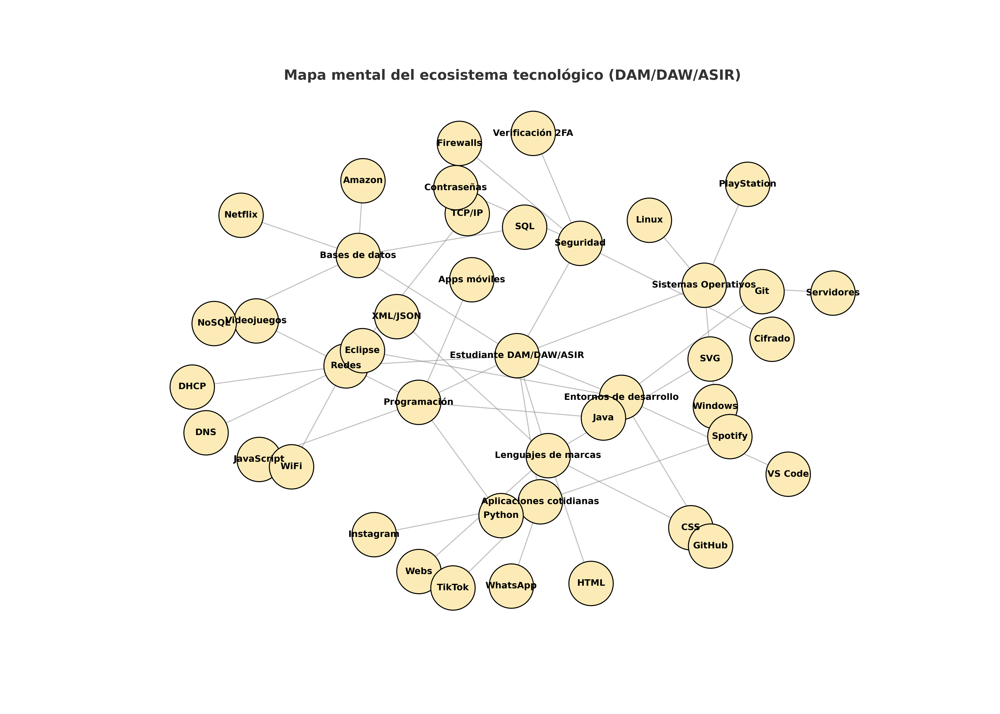

#  **Mapa mental del ecosistema tecnológico**

## **1. Fundamentos de Programación**

* **Lenguajes básicos**: Java, Python, JavaScript.
* **Mundo real**: apps de móvil, webs interactivas, videojuegos, chatbots.
* **Ejemplos cercanos**: Minecraft (Java), Instagram (Python + Django), páginas interactivas (JavaScript).

---

## **2. Lenguajes de marcas**

* **HTML, CSS, XML, JSON, SVG.**
* **Mundo real**: toda la web moderna, a pps móviles híbridas, intercambios de datos.
* **Ejemplos cercanos**: código fuente de cualquier web, configuración en videojuegos, archivos `.svg` en logos que usan a diario.

---

## **3. Bases de datos**

* **SQL (MySQL, PostgreSQL), NoSQL (MongoDB).**
* **Mundo real**: redes sociales, tiendas online, apps de mensajería.
* **Ejemplos cercanos**: Netflix guarda tu historial, Amazon tus pedidos, WhatsApp tus conversaciones.

---

## **4. Sistemas Operativos (ASIR muy presente)**

* **Linux, Windows, virtualización.**
* **Mundo real**: servidores web, cloud, gestión de infraestructuras.
* **Ejemplos cercanos**: Google corre sobre Linux, tu PlayStation usa un sistema derivado de Unix.

---

## **5. Redes**

* **Protocolos TCP/IP, DNS, DHCP.**
* **Mundo real**: internet entero funciona gracias a esto.
* **Ejemplos cercanos**: cuando escriben “google.com” y funciona → DNS; cuando su móvil se conecta al WiFi → DHCP.

---

## **6. Entornos de Desarrollo**

* **VS Code, Eclipse, IntelliJ, Git, GitHub.**
* **Mundo real**: cualquier programador profesional usa estas herramientas.
* **Ejemplos cercanos**: proyectos open source en GitHub, desarrolladores de videojuegos subiendo código.

---

## **7. Seguridad (ASIR destacado)**

* **Cifrado, contraseñas, firewalls.**
* **Mundo real**: banca online, pagos móviles, accesos corporativos.
* **Ejemplos cercanos**: inicio de sesión en Instagram, verificación en dos pasos de Gmail.

---

## **8. Aplicaciones cotidianas**

  * **WhatsApp** → protocolos de red + bases de datos + cifrado.
  * **Spotify** → bases de datos + APIs + interfaces web/móviles.
  * **TikTok** → frontend (HTML/JS) + backend (Python/Java) + redes + servidores en la nube.

---

